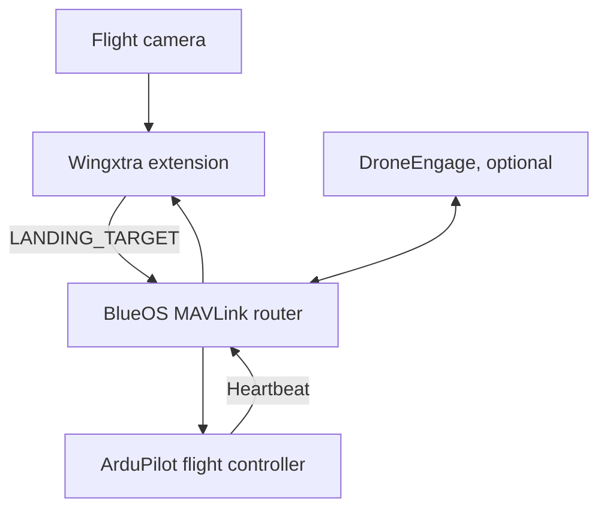

# Wingxtra Precision Landing — BlueOS extension

A companion-computer service that estimates the **shared landing-board origin from multiple AprilTags**, using calibrated camera intrinsics and the physical board dimensions. It sends MAVLink 2 `LANDING_TARGET` position measurements to ArduPilot through an onboard router.

**Version 1.0.0-rc.2 is a release candidate for integration and aircraft validation.** Automated software tests do not establish flight qualification. This repository includes the extension, calibration interface, tests, and a commissioning procedure; no camera/aircraft combination is yet listed as flight validated.

## What is included

- Original joint board-pose implementation with AprilTag `tag36h11`, robust multi-tag fitting and whole-tag outlier rejection. A single visible known tag can still locate the common board origin.
- Correct `BODY_FRD` position, positive PnP distance, capture/receipt timestamp and persistent MAVLink sequence numbers.
- Recent autopilot heartbeat requirement; stale, repeated, distant, poor-fit and jumping measurements are suppressed. Lost targets must be reacquired.
- BlueOS web interface: live preview, camera/mount setup, board import and SVG export, calibration capture/solve/import/export, connection settings and local diagnostic logs.
- Camera calibration bound to the source, camera identity, lens profile and resolution. No aircraft calibration is shipped.
- RTSP, HTTP MJPEG and USB/V4L2 input. Picamera2 is optional for a native Raspberry Pi installation; it is never an unconditional import.
- Docker/BlueOS packaging for **64-bit ARM and x86-64**. The candidate image does not support 32-bit ARM or direct CSI/libcamera access inside the container.
- Native DroneEngage DataBus output as an advanced option, with corrected registration, routing envelope and UDP chunk framing. A separate raw MAVLink heartbeat feed is required.

## Install on BlueOS

Follow [the BlueOS installation guide](docs/BLUEOS_INSTALL.md). The default architecture is:



BlueOS owns the physical flight-controller link. This extension never opens a serial MAVLink port. Only one precision-landing publisher should be active for a vehicle.

The workflow in **Actions → Validate and package BlueOS extension** tests both architectures, exports loadable image archives and, when registry permissions allow, publishes a commit-specific image:

```
ghcr.io/wingxtra-aerospace/wingxtra-de-precision-landing:sha-<full-commit-sha>
```

Use only a commit whose complete workflow passed. Image publication and package visibility depend on the repository's Actions/GHCR permissions; check the run before attempting installation. There is no `latest` tag and no automatic installation on an aircraft.

For a local Docker build:

```bash
docker build --target test -t wingxtra-pl-tests .
docker compose up --build -d
```

Open `http://<companion-ip>:8077/`. Set up the camera and UDP endpoint, calibrate, verify the target board, and complete [commissioning](docs/COMMISSIONING.md). First startup has output stopped. Reboot behavior is explicitly configurable.

## Native development / Raspberry Pi

Python 3.11 or newer on Linux 5.1 or newer (kernel UDP receive timestamps are required):

```bash
python3 -m venv .venv
. .venv/bin/activate
pip install -e '.[vision,test]'
wingxtra-pl --data-dir ./data --dry-run
pytest -q
```

`--dry-run` inhibits MAVLink target output for the lifetime of the process, including requests from the interface. A native Raspberry Pi using the distribution's Picamera2/OpenCV packages should use a virtual environment with `--system-site-packages` and install `.[test]` instead of `.[vision,test]`; see [native installation](docs/NATIVE_INSTALL.md).

Runtime files live in `data/` (or `/data` in the container): `config.json`, `landing-target.json`, `camera.json` and rotating `measurements.jsonl` logs. Imports of `config.yaml` use `wingxtra-pl --config config.yaml`. Camera calibration and runtime files are excluded from git.

## Range and coordinates

The board's `object_points` are detection-corner coordinates **in metres**. They define the physical scale and the common landing origin. Do not substitute `size_mm`: exports may include a white quiet margin in that value. A board printed at the wrong scale produces the wrong distance even with a low reprojection error.

Default downward camera transform: `forward = -image_y`, `right = image_x`, `down = optical_z`. Set the camera lever arm in ArduPilot `PLND_CAM_POS_*`; do not add it again in this service.

PnP supplies a distance, so the vision measurement does not inherently require an additional downward rangefinder. The aircraft still needs a working autopilot altitude/navigation solution. Lighting, motion blur, board pixel size, mounting and camera latency determine the usable operating range; no altitude or accuracy envelope is claimed without aircraft measurements.

## Validation and provenance

See [architecture and failure behavior](docs/ARCHITECTURE_OVERVIEW.md), [commissioning and test evidence](docs/COMMISSIONING.md), [the second code review](docs/SECOND_REVIEW.md), and [changes from the earlier implementation](docs/CHANGELOG.md).

The extension follows the [BlueOS extension interface](https://blueos.cloud/docs/stable/development/extensions/) and [MAVLink landing-target protocol](https://mavlink.io/en/services/landing_target.html). ArduPilot integration uses the MAVLink precision-landing backend. QuadPlane requires additional version-matched flight-controller integration; see [installation](docs/BLUEOS_INSTALL.md). Tests cover decoded packet fields, rendered multi-tag images, calibration, UDP transport and service behavior. DataBus framing is checked against the [DroneEngage client protocol](https://github.com/DroneEngage/droneengage_databus/tree/main/python); live DroneEngage forwarding must also be verified on the installed version.

MIT licensed. The implementation does not incorporate code from the GPL-licensed BlueOS community precision-landing extension.
